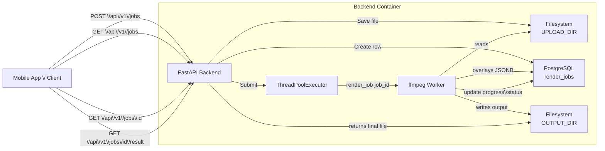
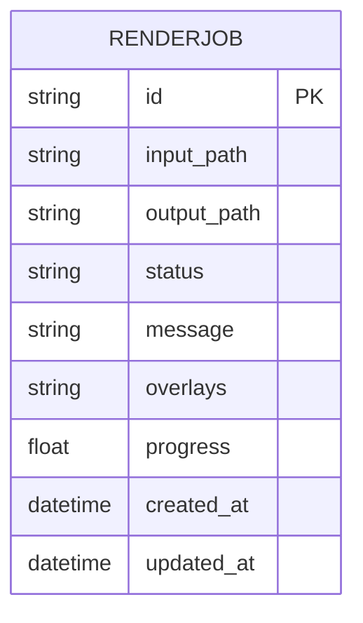
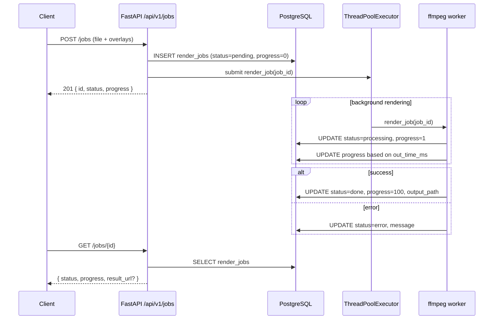

## 1. Overview

The backend is a **video rendering service** built with:

- **FastAPI** – HTTP API + validation
- **PostgreSQL** – job persistence
- **SQLAlchemy** – ORM
- **ffmpeg / ffprobe** – video processing & overlay rendering
- **ThreadPoolExecutor** – background rendering with progress updates
- **Docker Compose** – backend + Postgres + ffmpeg environment

Clients:

- Upload a video + overlays
- Poll for job status (`progress`, `status`)
- Download the rendered output when ready

---

## 2. High-level architecture



---

## 3. Configuration & directories

### 3.1 Settings (`app/core/config.py`)

Environment variables (via `BaseSettings`):

- `DATABASE_URL` – Postgres URL (e.g. `postgresql://user:pass@db:5432/video_editor`)
- `UPLOAD_DIR` – directory for incoming videos (default `/app/data/uploads`)
- `OUTPUT_DIR` – directory for rendered videos (default `/app/data/outputs`)
- `ASSETS_DIR` – directory for overlay assets (images/clips) (default `/app/data/assets`)
- `MAX_WORKERS` – thread pool size (e.g. `4`)

Settings are accessed as:

```python
from app.core.config import get_settings
settings = get_settings()
```

### 3.2 Directory layout inside the backend container

```
/backend
  app/
    main.py
    api/v1/...
    models/...
    services/
    core/
  data/
    uploads/    # raw uploaded videos
    outputs/    # rendered result videos
  assets/     # overlay assets (images, extra clips)

```

---

## 4. Database schema & models

### 4.1 `RenderJob` table

Single main table: **`render_jobs`**.



### 4.2 SQLAlchemy model (`app/models/job.py`)

```python
import enum
import uuid
from datetime import datetime

from sqlalchemy import Column, String, DateTime, Enum, Text, Float
from sqlalchemy.dialects.postgresql import JSONB

from app.core.db import Base

class JobStatusEnum(str, enum.Enum):
    pending = "pending"
    processing = "processing"
    done = "done"
    error = "error"

class RenderJob(Base):
    __tablename__ = "render_jobs"

    id = Column(String, primary_key=True, default=lambda: str(uuid.uuid4()))
    input_path = Column(String, nullable=False)
    output_path = Column(String, nullable=True)

    status = Column(Enum(JobStatusEnum), nullable=False, default=JobStatusEnum.pending)
    message = Column(Text, nullable=True)

    overlays = Column(JSONB, nullable=False)  # list[Overlay] as JSON
    progress = Column(Float, nullable=False, default=0.0)

    created_at = Column(DateTime, default=datetime.utcnow, nullable=False)
    updated_at = Column(
        DateTime,
        default=datetime.utcnow,
        onupdate=datetime.utcnow,
        nullable=False,
    )

```

---

## 5. Overlay schema (Pydantic)

### 5.1 Overlay object (`app/schemas/overlay.py`)

```python
from pydantic import BaseModel, ConfigDict
from typing import Literal, Optional

OverlayType = Literal["text", "image", "video"]

class Overlay(BaseModel):
    model_config = ConfigDict(from_attributes=True)

    type: OverlayType               # "text" | "image" | "video"
    content: str                    # text, or filename of image/clip
    x: float                        # 0–1 (relative X position)
    y: float                        # 0–1 (relative Y position)
    start_time: float               # in seconds
    end_time: float                 # in seconds

    # TEXT-ONLY styling (optional)
    color: Optional[str] = None     # "white", "yellow", "#ffcc00", ...
    font_size: Optional[int] = None
    box: Optional[bool] = None      # enable/disable background box
    box_color: Optional[str] = None # e.g. "black@0.5"
    box_borderw: Optional[int] = None

```

Example JSON overlay list:

```json
[
  {
    "type": "text",
    "content": "Buttercut AI ✂️",
    "x": 0.5,
    "y": 0.1,
    "start_time": 0,
    "end_time": 3,
    "color": "#ffcc00",
    "font_size": 42,
    "box": true,
    "box_color": "black@0.5",
    "box_borderw": 10
  },
  {
    "type": "image",
    "content": "logo.png",
    "x": 0.1,
    "y": 0.1,
    "start_time": 1,
    "end_time": 5
  },
  {
    "type": "video",
    "content": "clip1.mp4",
    "x": 0.7,
    "y": 0.7,
    "start_time": 2,
    "end_time": 8
  }
]

```

---

## 6. Pydantic response schemas

### 6.1 Job base schemas (`app/schemas/job.py`)

```python
from typing import List, Optional
from pydantic import BaseModel, ConfigDict

from app.schemas.overlay import Overlay

class JobBase(BaseModel):
    model_config = ConfigDict(from_attributes=True)

    id: str
    status: str
    message: Optional[str] = None
    progress: float = 0.0

class JobCreateResponse(JobBase):
    pass

class JobStatusResponse(JobBase):
    result_url: Optional[str] = None

class JobDetail(JobBase):
    overlays: List[Overlay]
    input_path: str
    output_path: Optional[str] = None

```

---

## 7. Background processing & progress

### 7.1 Thread pool (`app/services/jobs.py`)

```python
from concurrent.futures import ThreadPoolExecutor
from sqlalchemy.orm import Session
from typing import List
import os
import uuid

from fastapi import UploadFile

from app.core.config import get_settings
from app.core.db import SessionLocal
from app.models.job import RenderJob, JobStatusEnum
from app.schemas.overlay import Overlay
from app.services.video_renderer import render_job

settings = get_settings()

executor = ThreadPoolExecutor(max_workers=settings.MAX_WORKERS)

def create_job(db: Session, video_file: UploadFile, overlays: List[Overlay]) -> RenderJob:
    # Save file to disk
    file_ext = os.path.splitext(video_file.filename or "")[1] or ".mp4"
    filename = f"{uuid.uuid4()}{file_ext}"
    file_path = os.path.join(settings.UPLOAD_DIR, filename)

    with open(file_path, "wb") as f:
        f.write(video_file.file.read())

    job = RenderJob(
        input_path=file_path,
        overlays=[o.dict() for o in overlays],
        status=JobStatusEnum.pending,
        message="Queued",
        progress=0.0,
    )
    db.add(job)
    db.commit()
    db.refresh(job)

    # Run in background
    executor.submit(_run_job_in_thread, job.id)

    return job

def _run_job_in_thread(job_id: str) -> None:
    db = SessionLocal()
    try:
        render_job(db, job_id)
    finally:
        db.close()

```

### 7.2 ffmpeg rendering & progress (`app/services/video_renderer.py`)

Conceptually:

1. Load job from DB, set `status=processing`, `progress=1.0`.
2. Use `ffprobe` to get video duration.
3. Build `ffmpeg` command with `filter_complex` for overlays.
4. Run ffmpeg with `progress pipe:2`, parse `out_time_ms` lines.
5. On each `out_time_ms`, compute percentage and update `job.progress`.
6. Set `status=done` and `progress=100.0` on success; `status=error` on failure.

Job lifecycle:



---

## 8. ffmpeg filter graph & overlays

### 8.1 Resolving asset paths

```python
def resolve_overlay_path(content: str) -> str:
    """
    If content is abs path and exists -> use it.
    Else treat as filename inside ASSETS_DIR.
    """
    if os.path.isabs(content) and os.path.exists(content):
        return content

    candidate = os.path.join(settings.ASSETS_DIR, content)
    if os.path.exists(candidate):
        return candidate

    raise FileNotFoundError(f"Overlay asset not found: {content} (looked in {candidate})")

```

### 8.2 Building `filter_complex`

```python
def build_filter_complex(overlays: List[Overlay]) -> tuple[str, list[str], str | None]:
    if not overlays:
        return "", [], None

    extra_inputs: List[str] = []
    chains: List[str] = []
    current_label = "[0:v]"
    label_index = 0

    for o in overlays:
        out_label = f"[v{label_index}]"

        if o.type == "text":
            x_expr = f"w*{o.x}"
            y_expr = f"h*{o.y}"
            text = o.content.replace(":", "\\\\:").replace("'", "\\\\'")

            font_color = (o.color or "white").strip()
            font_color = font_color.replace(":", "\\\\:").replace("'", "\\\\'")
            font_size = o.font_size or 36

            box_enabled = o.box if o.box is not None else True
            box_color = (o.box_color or "black@0.5").strip()
            box_color = box_color.replace(":", "\\\\:").replace("'", "\\\\'")
            box_borderw = o.box_borderw if o.box_borderw is not None else 5

            draw_opts = [
                f"text='{text}'",
                f"x={x_expr}",
                f"y={y_expr}",
                f"fontcolor={font_color}",
                f"fontsize={font_size}",
                f"enable='between(t,{o.start_time},{o.end_time})'",
            ]
            if box_enabled:
                draw_opts.append("box=1")
                draw_opts.append(f"boxcolor={box_color}")
                draw_opts.append(f"boxborderw={box_borderw}")

            chain = f"{current_label}drawtext=" + ":".join(draw_opts) + out_label

        elif o.type in ("image", "video"):
            asset_path = resolve_overlay_path(o.content)
            extra_inputs.append(asset_path)
            input_index = len(extra_inputs)  # 1-based, [1:v] etc.

            x_expr = f"w*{o.x}"
            y_expr = f"h*{o.y}"

            chain = (
                f"{current_label}[{input_index}:v]"
                f"overlay=x={x_expr}:y={y_expr}:"
                f"enable='between(t,{o.start_time},{o.end_time})'"
                f"{out_label}"
            )
        else:
            continue

        chains.append(chain)
        current_label = out_label
        label_index += 1

    filter_complex = "; ".join(chains)
    final_label = current_label
    return filter_complex, extra_inputs, final_label

```

---

## 9. API endpoints

Base URL (inside container):

`http://localhost:8000/api/v1`

### Summary

| Method | Path | Description |
| --- | --- | --- |
| POST | `/api/v1/jobs` | Upload video + overlays, create render job |
| GET | `/api/v1/jobs` | List all jobs |
| GET | `/api/v1/jobs/{job_id}` | Get job status + progress + result_url |
| GET | `/api/v1/jobs/{job_id}/detail` | Get full job details incl. overlays |
| GET | `/api/v1/jobs/{job_id}/result` | Download rendered video |
| POST | `/api/v1/assets` *(optional)* | Upload overlay assets (images/clips) |

---

### 9.1 `POST /api/v1/jobs` – Create render job

**Request**

- Content-Type: `multipart/form-data`
- Fields:
    - `file`: video file
    - `overlays`: JSON stringified list of `Overlay` objects

Example (Postman form-data):

- `file`: (select `.mp4`)
- `overlays` (text):

```json
[
  {
    "type": "text",
    "content": "Buttercut AI ✂️",
    "x": 0.5,
    "y": 0.1,
    "start_time": 0,
    "end_time": 3,
    "color": "white"
  },
  {
    "type": "image",
    "content": "logo.png",
    "x": 0.1,
    "y": 0.1,
    "start_time": 1,
    "end_time": 5
  }
]

```

**Response 201 – `JobCreateResponse`**

```json
{
  "id": "5aba2b1b-3995-4fab-bdf9-5f78fdf74472",
  "status": "pending",
  "message": "Queued",
  "progress": 0.0
}

```

---

### 9.2 `GET /api/v1/jobs` – List jobs

**Response 200 – `Job[]` (lightweight)**

```json
[
  {
    "id": "5aba2b1b-3995-4fab-bdf9-5f78fdf74472",
    "status": "processing",
    "message": "Processing with ffmpeg",
    "progress": 37.4,
    "created_at": "2025-11-27T06:14:10.622648"
  },
  {
    "id": "ab1cd234-5678-90ef-1234-56789abcdef0",
    "status": "done",
    "message": "Rendering complete",
    "progress": 100.0,
    "created_at": "2025-11-26T11:02:01.123456"
  }
]

```

Used by the frontend “project list” screen.

---

### 9.3 `GET /api/v1/jobs/{job_id}` – Job status & progress

**Response 200 – `JobStatusResponse`**

```json
{
  "id": "5aba2b1b-3995-4fab-bdf9-5f78fdf74472",
  "status": "processing",
  "message": "Processing with ffmpeg",
  "progress": 42.5,
  "result_url": null
}

```

When done:

```json
{
  "id": "5aba2b1b-3995-4fab-bdf9-5f78fdf74472",
  "status": "done",
  "message": "Rendering complete",
  "progress": 100.0,
  "result_url": "/api/v1/jobs/5aba2b1b-3995-4fab-bdf9-5f78fdf74472/result"
}

```

**Response 404**

```json
{ "detail": "Job not found" }

```

---

### 9.4 `GET /api/v1/jobs/{job_id}/detail` – Full job details

**Response 200 – `JobDetail`**

```json
{
  "id": "5aba2b1b-3995-4fab-bdf9-5f78fdf74472",
  "status": "done",
  "message": "Rendering complete",
  "progress": 100.0,
  "input_path": "/app/data/uploads/input_video.mp4",
  "output_path": "/app/data/outputs/5aba2b1b-3995-4fab-bdf9-5f78fdf74472_output.mp4",
  "overlays": [
    {
      "type": "text",
      "content": "Buttercut AI ✂️",
      "x": 0.5,
      "y": 0.1,
      "start_time": 0.0,
      "end_time": 3.0,
      "color": "white",
      "font_size": 42,
      "box": true,
      "box_color": "black@0.5",
      "box_borderw": 10
    },
    {
      "type": "image",
      "content": "logo.png",
      "x": 0.1,
      "y": 0.1,
      "start_time": 1.0,
      "end_time": 5.0
    }
  ]
}

```

---

### 9.5 `GET /api/v1/jobs/{job_id}/result` – Download rendered video

**Response 200**

- `Content-Type: video/mp4`
- `Content-Disposition: attachment; filename="<job_id>_output.mp4"`

The backend typically uses `FileResponse(output_path)`.

**Response 404**

```json
{ "detail": "Result not ready" }

```

(or `"Job not found"` if job doesn’t exist)

---

### 9.6 `POST /api/v1/assets` – Upload overlay asset (optional)

If you support uploading overlays (images/clips) separately:

**Request**

- `multipart/form-data`
- field: `file`

**Response 201**

```json
{
  "filename": "23b3aed4-c75b-4f96-a880-b725eddf1b60.png",
  "relative_path": "23b3aed4-c75b-4f96-a880-b725eddf1b60.png"
}

```

Then the frontend sets `overlay.content = "23b3aed4-c75b-4f96-a880-b725eddf1b60.png"`.