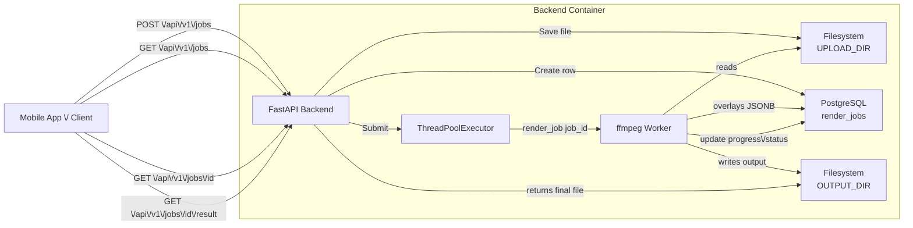
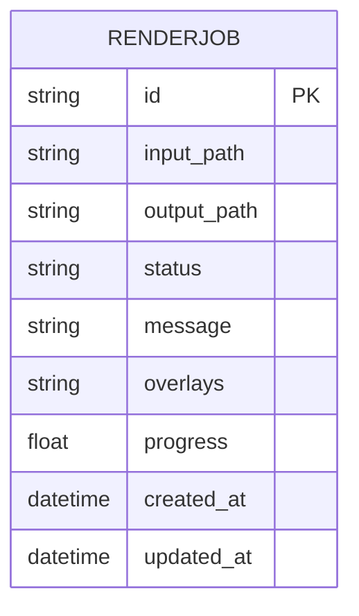
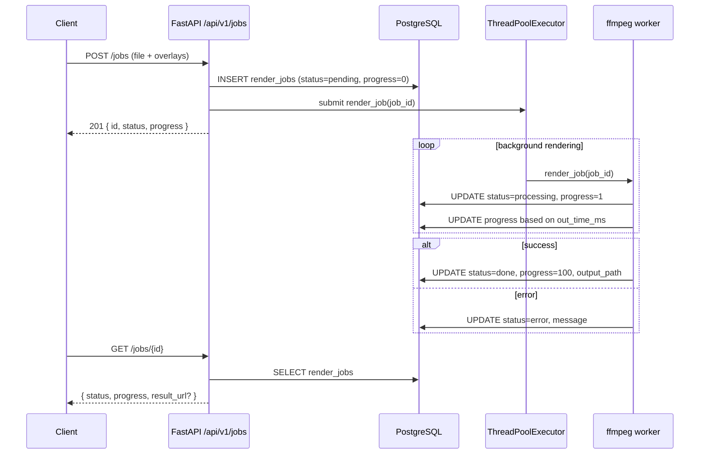
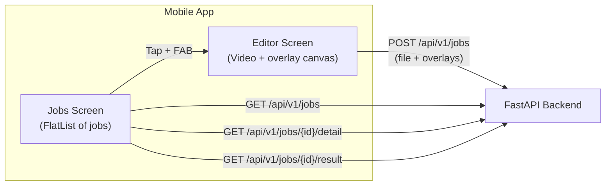

# Backend (FastAPI + ffmpeg)

## 1. Overview

The backend is a **video rendering service** built with:

- **FastAPI** – HTTP API + validation
- **PostgreSQL** – job persistence
- **SQLAlchemy** – ORM
- **ffmpeg / ffprobe** – video processing & overlay rendering
- **ThreadPoolExecutor** – background rendering with progress updates
- **Docker Compose** – backend + Postgres + ffmpeg environment

Clients:

- Upload a video + overlays
- Poll for job status (`progress`, `status`)
- Download the rendered output when ready

---

## 2. High-level architecture



---

## 3. Configuration & directories

### 3.1 Settings (`app/core/config.py`)

Environment variables (via `BaseSettings`):

- `DATABASE_URL` – Postgres URL (e.g. `postgresql://user:pass@db:5432/video_editor`)
- `UPLOAD_DIR` – directory for incoming videos (default `/app/data/uploads`)
- `OUTPUT_DIR` – directory for rendered videos (default `/app/data/outputs`)
- `ASSETS_DIR` – directory for overlay assets (images/clips) (default `/app/data/assets`)
- `MAX_WORKERS` – thread pool size (e.g. `4`)

Settings are accessed as:

```python
from app.core.config import get_settings
settings = get_settings()
```

### 3.2 Directory layout inside the backend container

```
/backend
  app/
    main.py
    api/v1/...
    models/...
    services/
    core/
  data/
    uploads/    # raw uploaded videos
    outputs/    # rendered result videos
  assets/     # overlay assets (images, extra clips)

```

---

## 4. Database schema & models

### 4.1 `RenderJob` table

Single main table: **`render_jobs`**.



### 4.2 SQLAlchemy model (`app/models/job.py`)

```python
import enum
import uuid
from datetime import datetime

from sqlalchemy import Column, String, DateTime, Enum, Text, Float
from sqlalchemy.dialects.postgresql import JSONB

from app.core.db import Base

class JobStatusEnum(str, enum.Enum):
    pending = "pending"
    processing = "processing"
    done = "done"
    error = "error"

class RenderJob(Base):
    __tablename__ = "render_jobs"

    id = Column(String, primary_key=True, default=lambda: str(uuid.uuid4()))
    input_path = Column(String, nullable=False)
    output_path = Column(String, nullable=True)

    status = Column(Enum(JobStatusEnum), nullable=False, default=JobStatusEnum.pending)
    message = Column(Text, nullable=True)

    overlays = Column(JSONB, nullable=False)  # list[Overlay] as JSON
    progress = Column(Float, nullable=False, default=0.0)

    created_at = Column(DateTime, default=datetime.utcnow, nullable=False)
    updated_at = Column(
        DateTime,
        default=datetime.utcnow,
        onupdate=datetime.utcnow,
        nullable=False,
    )

```

---

## 5. Overlay schema (Pydantic)

### 5.1 Overlay object (`app/schemas/overlay.py`)

```python
from pydantic import BaseModel, ConfigDict
from typing import Literal, Optional

OverlayType = Literal["text", "image", "video"]

class Overlay(BaseModel):
    model_config = ConfigDict(from_attributes=True)

    type: OverlayType               # "text" | "image" | "video"
    content: str                    # text, or filename of image/clip
    x: float                        # 0–1 (relative X position)
    y: float                        # 0–1 (relative Y position)
    start_time: float               # in seconds
    end_time: float                 # in seconds

    # TEXT-ONLY styling (optional)
    color: Optional[str] = None     # "white", "yellow", "#ffcc00", ...
    font_size: Optional[int] = None
    box: Optional[bool] = None      # enable/disable background box
    box_color: Optional[str] = None # e.g. "black@0.5"
    box_borderw: Optional[int] = None

```

Example JSON overlay list:

```json
[
  {
    "type": "text",
    "content": "Buttercut AI ✂️",
    "x": 0.5,
    "y": 0.1,
    "start_time": 0,
    "end_time": 3,
    "color": "#ffcc00",
    "font_size": 42,
    "box": true,
    "box_color": "black@0.5",
    "box_borderw": 10
  },
  {
    "type": "image",
    "content": "logo.png",
    "x": 0.1,
    "y": 0.1,
    "start_time": 1,
    "end_time": 5
  },
  {
    "type": "video",
    "content": "clip1.mp4",
    "x": 0.7,
    "y": 0.7,
    "start_time": 2,
    "end_time": 8
  }
]

```

---

## 6. Pydantic response schemas

### 6.1 Job base schemas (`app/schemas/job.py`)

```python
from typing import List, Optional
from pydantic import BaseModel, ConfigDict

from app.schemas.overlay import Overlay

class JobBase(BaseModel):
    model_config = ConfigDict(from_attributes=True)

    id: str
    status: str
    message: Optional[str] = None
    progress: float = 0.0

class JobCreateResponse(JobBase):
    pass

class JobStatusResponse(JobBase):
    result_url: Optional[str] = None

class JobDetail(JobBase):
    overlays: List[Overlay]
    input_path: str
    output_path: Optional[str] = None

```

---

## 7. Background processing & progress

### 7.1 Thread pool (`app/services/jobs.py`)

```python
from concurrent.futures import ThreadPoolExecutor
from sqlalchemy.orm import Session
from typing import List
import os
import uuid

from fastapi import UploadFile

from app.core.config import get_settings
from app.core.db import SessionLocal
from app.models.job import RenderJob, JobStatusEnum
from app.schemas.overlay import Overlay
from app.services.video_renderer import render_job

settings = get_settings()

executor = ThreadPoolExecutor(max_workers=settings.MAX_WORKERS)

def create_job(db: Session, video_file: UploadFile, overlays: List[Overlay]) -> RenderJob:
    # Save file to disk
    file_ext = os.path.splitext(video_file.filename or "")[1] or ".mp4"
    filename = f"{uuid.uuid4()}{file_ext}"
    file_path = os.path.join(settings.UPLOAD_DIR, filename)

    with open(file_path, "wb") as f:
        f.write(video_file.file.read())

    job = RenderJob(
        input_path=file_path,
        overlays=[o.dict() for o in overlays],
        status=JobStatusEnum.pending,
        message="Queued",
        progress=0.0,
    )
    db.add(job)
    db.commit()
    db.refresh(job)

    # Run in background
    executor.submit(_run_job_in_thread, job.id)

    return job

def _run_job_in_thread(job_id: str) -> None:
    db = SessionLocal()
    try:
        render_job(db, job_id)
    finally:
        db.close()

```

### 7.2 ffmpeg rendering & progress (`app/services/video_renderer.py`)

Conceptually:

1. Load job from DB, set `status=processing`, `progress=1.0`.
2. Use `ffprobe` to get video duration.
3. Build `ffmpeg` command with `filter_complex` for overlays.
4. Run ffmpeg with `progress pipe:2`, parse `out_time_ms` lines.
5. On each `out_time_ms`, compute percentage and update `job.progress`.
6. Set `status=done` and `progress=100.0` on success; `status=error` on failure.

Job lifecycle:



---

## 8. ffmpeg filter graph & overlays

### 8.1 Resolving asset paths

```python
def resolve_overlay_path(content: str) -> str:
    """
    If content is abs path and exists -> use it.
    Else treat as filename inside ASSETS_DIR.
    """
    if os.path.isabs(content) and os.path.exists(content):
        return content

    candidate = os.path.join(settings.ASSETS_DIR, content)
    if os.path.exists(candidate):
        return candidate

    raise FileNotFoundError(f"Overlay asset not found: {content} (looked in {candidate})")

```

### 8.2 Building `filter_complex`

```python
def build_filter_complex(overlays: List[Overlay]) -> tuple[str, list[str], str | None]:
    if not overlays:
        return "", [], None

    extra_inputs: List[str] = []
    chains: List[str] = []
    current_label = "[0:v]"
    label_index = 0

    for o in overlays:
        out_label = f"[v{label_index}]"

        if o.type == "text":
            x_expr = f"w*{o.x}"
            y_expr = f"h*{o.y}"
            text = o.content.replace(":", "\\\\:").replace("'", "\\\\'")

            font_color = (o.color or "white").strip()
            font_color = font_color.replace(":", "\\\\:").replace("'", "\\\\'")
            font_size = o.font_size or 36

            box_enabled = o.box if o.box is not None else True
            box_color = (o.box_color or "black@0.5").strip()
            box_color = box_color.replace(":", "\\\\:").replace("'", "\\\\'")
            box_borderw = o.box_borderw if o.box_borderw is not None else 5

            draw_opts = [
                f"text='{text}'",
                f"x={x_expr}",
                f"y={y_expr}",
                f"fontcolor={font_color}",
                f"fontsize={font_size}",
                f"enable='between(t,{o.start_time},{o.end_time})'",
            ]
            if box_enabled:
                draw_opts.append("box=1")
                draw_opts.append(f"boxcolor={box_color}")
                draw_opts.append(f"boxborderw={box_borderw}")

            chain = f"{current_label}drawtext=" + ":".join(draw_opts) + out_label

        elif o.type in ("image", "video"):
            asset_path = resolve_overlay_path(o.content)
            extra_inputs.append(asset_path)
            input_index = len(extra_inputs)  # 1-based, [1:v] etc.

            x_expr = f"w*{o.x}"
            y_expr = f"h*{o.y}"

            chain = (
                f"{current_label}[{input_index}:v]"
                f"overlay=x={x_expr}:y={y_expr}:"
                f"enable='between(t,{o.start_time},{o.end_time})'"
                f"{out_label}"
            )
        else:
            continue

        chains.append(chain)
        current_label = out_label
        label_index += 1

    filter_complex = "; ".join(chains)
    final_label = current_label
    return filter_complex, extra_inputs, final_label

```

---

## 9. API endpoints

Base URL (inside container):

`http://localhost:8000/api/v1`

### Summary

| Method | Path | Description |
| --- | --- | --- |
| POST | `/api/v1/jobs` | Upload video + overlays, create render job |
| GET | `/api/v1/jobs` | List all jobs |
| GET | `/api/v1/jobs/{job_id}` | Get job status + progress + result_url |
| GET | `/api/v1/jobs/{job_id}/detail` | Get full job details incl. overlays |
| GET | `/api/v1/jobs/{job_id}/result` | Download rendered video |
| POST | `/api/v1/assets` *(optional)* | Upload overlay assets (images/clips) |

---

### 9.1 `POST /api/v1/jobs` – Create render job

**Request**

- Content-Type: `multipart/form-data`
- Fields:
    - `file`: video file
    - `overlays`: JSON stringified list of `Overlay` objects

Example (Postman form-data):

- `file`: (select `.mp4`)
- `overlays` (text):

```json
[
  {
    "type": "text",
    "content": "Buttercut AI ✂️",
    "x": 0.5,
    "y": 0.1,
    "start_time": 0,
    "end_time": 3,
    "color": "white"
  },
  {
    "type": "image",
    "content": "logo.png",
    "x": 0.1,
    "y": 0.1,
    "start_time": 1,
    "end_time": 5
  }
]

```

**Response 201 – `JobCreateResponse`**

```json
{
  "id": "5aba2b1b-3995-4fab-bdf9-5f78fdf74472",
  "status": "pending",
  "message": "Queued",
  "progress": 0.0
}

```

---

### 9.2 `GET /api/v1/jobs` – List jobs

**Response 200 – `Job[]` (lightweight)**

```json
[
  {
    "id": "5aba2b1b-3995-4fab-bdf9-5f78fdf74472",
    "status": "processing",
    "message": "Processing with ffmpeg",
    "progress": 37.4,
    "created_at": "2025-11-27T06:14:10.622648"
  },
  {
    "id": "ab1cd234-5678-90ef-1234-56789abcdef0",
    "status": "done",
    "message": "Rendering complete",
    "progress": 100.0,
    "created_at": "2025-11-26T11:02:01.123456"
  }
]

```

Used by the frontend “project list” screen.

---

### 9.3 `GET /api/v1/jobs/{job_id}` – Job status & progress

**Response 200 – `JobStatusResponse`**

```json
{
  "id": "5aba2b1b-3995-4fab-bdf9-5f78fdf74472",
  "status": "processing",
  "message": "Processing with ffmpeg",
  "progress": 42.5,
  "result_url": null
}

```

When done:

```json
{
  "id": "5aba2b1b-3995-4fab-bdf9-5f78fdf74472",
  "status": "done",
  "message": "Rendering complete",
  "progress": 100.0,
  "result_url": "/api/v1/jobs/5aba2b1b-3995-4fab-bdf9-5f78fdf74472/result"
}

```

**Response 404**

```json
{ "detail": "Job not found" }

```

---

### 9.4 `GET /api/v1/jobs/{job_id}/detail` – Full job details

**Response 200 – `JobDetail`**

```json
{
  "id": "5aba2b1b-3995-4fab-bdf9-5f78fdf74472",
  "status": "done",
  "message": "Rendering complete",
  "progress": 100.0,
  "input_path": "/app/data/uploads/input_video.mp4",
  "output_path": "/app/data/outputs/5aba2b1b-3995-4fab-bdf9-5f78fdf74472_output.mp4",
  "overlays": [
    {
      "type": "text",
      "content": "Buttercut AI ✂️",
      "x": 0.5,
      "y": 0.1,
      "start_time": 0.0,
      "end_time": 3.0,
      "color": "white",
      "font_size": 42,
      "box": true,
      "box_color": "black@0.5",
      "box_borderw": 10
    },
    {
      "type": "image",
      "content": "logo.png",
      "x": 0.1,
      "y": 0.1,
      "start_time": 1.0,
      "end_time": 5.0
    }
  ]
}

```

---

### 9.5 `GET /api/v1/jobs/{job_id}/result` – Download rendered video

**Response 200**

- `Content-Type: video/mp4`
- `Content-Disposition: attachment; filename="<job_id>_output.mp4"`

The backend typically uses `FileResponse(output_path)`.

**Response 404**

```json
{ "detail": "Result not ready" }

```

(or `"Job not found"` if job doesn’t exist)

---

### 9.6 `POST /api/v1/assets` – Upload overlay asset (optional)

If you support uploading overlays (images/clips) separately:

**Request**

- `multipart/form-data`
- field: `file`

**Response 201**

```json
{
  "filename": "23b3aed4-c75b-4f96-a880-b725eddf1b60.png",
  "relative_path": "23b3aed4-c75b-4f96-a880-b725eddf1b60.png"
}

```

Then the frontend sets `overlay.content = "23b3aed4-c75b-4f96-a880-b725eddf1b60.png"`.

----------

# Frontend (Expo + React Native)

## 1. Overview

The frontend is a **mobile video editing client** built with:

-   **Expo / React Native** – mobile app framework
    
-   **expo-av** – video playback
    
-   **expo-document-picker** – selecting videos and overlay assets
    
-   **@react-native-community/slider** – time-range sliders
    
-   **react-native-svg** – circular progress indicator for jobs
    
-   **expo-file-system** – downloading rendered videos to device storage
    
-   **axios** – HTTP client for talking to the FastAPI backend
    

The app provides:

-   A **Projects list** screen that shows all render jobs and their progress, with a circular progress “thumbnail” and a download button.
    
-   A **Video editor** screen where the user:
    
    -   Picks a base video
        
    -   Adds text/image/clip overlays
        
    -   Drags overlays around on a “canvas” (the video preview)
        
    -   Configures overlay timing and text styling
        
    -   Submits a render job to the backend.
        

----------

## 2. High-level architecture



-   **Jobs Screen** fetches job list from `/api/v1/jobs`.
    
-   Each job item fetches its detail from `/api/v1/jobs/{id}/detail` and allows downloading `/api/v1/jobs/{id}/result`.
    
-   **Editor Screen** builds up overlay metadata and submits to `/api/v1/jobs`.
    

----------

## 3. Project structure

Inside `frontend/`:

```text
frontend/
  app/
    index.tsx            # Jobs list screen (root)
    editor.tsx           # Video editor screen
  components/
    JobListItem.tsx      # Single job card with progress + download
    JobsHeader.tsx       # "Your Projects" header for FlatList
    OverlayPreview.tsx   # Video + draggable overlay canvas
    TextOverlayEditor.tsx# Controls for text overlays
    OverlayTimingControls.tsx  # Controls for timing (image/video overlays)
    CircularProgress.tsx # SVG-based circular progress ring
  lib/
    api.ts               # axios instance + API_BASE_URL
    types.ts             # Shared TS types for Job, Overlay, JobDetail
  styles/
    common.ts            # Color palette & shared styling tokens
    jobsScreen.ts        # Styles for Jobs screen + cards
    editorScreen.ts      # Styles for editor screen

```

----------

## 4. Shared types & API client

### 4.1 Types (`lib/types.ts`)

Frontend types mirror backend schemas (plus some UI-only fields):

```ts
export type JobStatus = "pending" | "processing" | "done" | "error";

export interface Job {
  id: string;
  status: JobStatus;
  message?: string | null;
  progress?: number | null;
  created_at?: string;
}

export type OverlayType = "text" | "image" | "video";

export interface Overlay {
  id?: string;        // frontend-only, for selection/drag
  type: OverlayType;
  content: string;    // text, or filename for image/clip
  x: number;          // 0–1
  y: number;          // 0–1
  start_time: number; // seconds
  end_time: number;

  // text styling
  color?: string;
  font_size?: number;
  box?: boolean;
  box_color?: string;
  box_borderw?: number;
}

export interface JobDetail extends Job {
  overlays: Overlay[];
  input_path: string;
  output_path: string | null;
}

```

### 4.2 API client (`lib/api.ts`)

```ts
import axios from "axios";

export const API_BASE_URL = "http://10.0.2.2:8000"; // for Android emulator
// or "http://localhost:8000" for iOS simulator / web
// or "http://LOCAL_IP:8000" for Real-Device Testing

export const api = axios.create({
  baseURL: `${API_BASE_URL}/api/v1`,
  timeout: 10000,
});

```

----------

## 5. Screens

### 5.1 Jobs Screen (`app/index.tsx`)

The Jobs screen:

-   Fetches all jobs from `GET /api/v1/jobs`.
    
-   Shows them in a `FlatList`.
    
-   Displays a **circular progress** thumbnail or a checkmark when done.
    
-   Has a **FAB (+)** to start a new project and navigate to the editor.
    

**Key behaviors:**

-   Uses `useEffect` or `useFocusEffect` to call `fetchJobs()` on mount/focus.
    
-   `RefreshControl` on the `FlatList` enables pull-to-refresh.
    
-   Empty state shows “Start a new project” if no jobs.
    

**Core logic (simplified):**

```tsx
const [jobs, setJobs] = useState<Job[]>([]);
const [loading, setLoading] = useState(false);

const fetchJobs = useCallback(async () => {
  try {
    setLoading(true);
    const res = await api.get<Job[]>("/jobs");
    setJobs(res.data);
  } catch (e) {
    console.log("Failed to fetch jobs", e);
  } finally {
    setLoading(false);
  }
}, []);

useEffect(() => {
  fetchJobs();
}, [fetchJobs]);

```

The list:

```tsx
<FlatList
  contentContainerStyle={jobsStyles.listContent}
  data={jobs}
  keyExtractor={(item) => item.id}
  ListHeaderComponent={() => <JobsHeader count={jobs.length} />}
  renderItem={({ item }) => <JobListItem job={item} />}
  refreshControl={
    <RefreshControl refreshing={loading} onRefresh={fetchJobs} />
  }
/>

```

Floating action button:

```tsx
<TouchableOpacity
  style={jobsStyles.fab}
  onPress={() => router.push("/editor")}
>
  <Feather name="plus" size={24} color="#fff" />
</TouchableOpacity>

```

----------

### 5.2 Job card (`components/JobListItem.tsx`)

Each job card:

-   Fetches **detail** on mount: `GET /api/v1/jobs/{job_id}/detail`.
    
-   Shows status, message, and a circular progress thumbnail.
    
-   If job is `done` and has `output_path`, enables a **download button** that:
    
    -   Calls `GET /api/v1/jobs/{job_id}/result` via `expo-file-system`
        
    -   Saves MP4 to app’s document directory (or a subfolder like `ButterCutDownloads`).
        

**Detail fetch:**

```ts
useEffect(() => {
  let cancelled = false;

  const fetchDetail = async () => {
    try {
      setLoadingDetail(true);
      const res = await api.get<JobDetail>(`/jobs/${job.id}/detail`);
      if (!cancelled) setDetail(res.data);
    } catch (e) {
      console.log("Failed to load job detail", e);
    } finally {
      if (!cancelled) setLoadingDetail(false);
    }
  };

  fetchDetail();
  return () => {
    cancelled = true;
  };
}, [job.id]);

```

**Progress & state:**

```ts
const progress = detail?.progress ?? job.progress ?? 0;
const status: JobStatus = (detail?.status as JobStatus) ?? job.status;
const isDone = status === "done" && progress >= 100;
const hasResult = isDone && !!detail?.output_path;

```

**Download with `expo-file-system`:**

```ts
import * as FileSystem from "expo-file-system";

const handleDownload = async () => {
  if (!hasResult) return;

  try {
    const remoteUrl = `${API_BASE_URL}/api/v1/jobs/${job.id}/result`;
    const dir = FileSystem.documentDirectory + "ButterCutDownloads/";

    await FileSystem.makeDirectoryAsync(dir, { intermediates: true });

    const fileUri = dir + `${job.id}_output.mp4`;
    const result = await FileSystem.downloadAsync(remoteUrl, fileUri);

    console.log("Download complete:", result);
    Alert.alert("Download complete", `Saved to:\n${fileUri}`);
  } catch (error) {
    console.error("Download error:", error);
    Alert.alert("Error", "Failed to download file");
  }
};

```

**Circular progress in thumbnail:**

```tsx
<View style={jobsStyles.thumbnail}>
  {isDone ? (
    <Feather name="check" size={24} color={colors.success} />
  ) : (
    <View style={{ alignItems: "center", justifyContent: "center" }}>
      <View
        style={{
          position: "absolute",
          alignItems: "center",
          justifyContent: "center",
        }}
      >
        <Text style={{ fontSize: 10, color: "#4b5563", marginBottom: 2 }}>
          {status === "error" ? "Error" : "Rendering"}
        </Text>
        <Text style={{ fontSize: 11, fontWeight: "600" }}>
          {Math.round(progress)}%
        </Text>
      </View>

      <CircularProgress
        size={48}
        strokeWidth={4}
        progress={progress}
        color={colors.primary}
        backgroundColor="#e5e7eb"
      />
    </View>
  )}
</View>

```

----------

### 5.3 Jobs header (`components/JobsHeader.tsx`)

Simple header for the list:

```tsx
interface JobsHeaderProps {
  count: number;
}

const JobsHeader: React.FC<JobsHeaderProps> = ({ count }) => {
  const subtitle =
    count === 0
      ? "Start a new project to see it appear here."
      : `${count} project${count === 1 ? "" : "s"} in your workspace`;

  return (
    <View style={jobsStyles.headerContainer}>
      <Text style={jobsStyles.headerTitle}>Your Projects</Text>
      <Text style={jobsStyles.headerSubtitle}>{subtitle}</Text>
    </View>
  );
};

```

----------

## 6. Editor Screen

### 6.1 Overview (`app/editor.tsx`)

The editor screen:

-   Shows a **canvas video area**:
    
    -   If no video selected → big upload CTA in the canvas area itself.
        
    -   If video selected → plays video and overlays are drawn on top.
        
-   Under the canvas is a **bottom panel**:
    
    -   Buttons to add **Text**, **Image**, or **Clip** overlay.
        
    -   A **Render** button to submit the job.
        
    -   A dynamic editor section for the currently selected overlay.
        

Key state:

```ts
const [video, setVideo] = useState<SelectedVideo | null>(null);
const [videoDurationSec, setVideoDurationSec] = useState<number | null>(null);
const [overlays, setOverlays] = useState<Overlay[]>([]);
const [selectedOverlayId, setSelectedOverlayId] = useState<string | null>(null);
const [isSubmitting, setIsSubmitting] = useState(false);
const [isUploadingAsset, setIsUploadingAsset] = useState(false);

```

`SelectedVideo` includes:

```ts
type SelectedVideo = {
  uri: string;
  name: string;
  mimeType?: string | null;
};

```

### 6.2 Video selection

When user taps the upload CTA (inside `OverlayPreview` when no video):

```ts
const pickMainVideo = async () => {
  const result = await DocumentPicker.getDocumentAsync({
    type: "video/*",
    copyToCacheDirectory: true,
  });

  if (result.type === "success") {
    setVideo({
      uri: result.uri,
      name: result.name,
      mimeType: result.mimeType,
    });
    setVideoDurationSec(null);
    setOverlays([]);
    setSelectedOverlayId(null);
  }
};

```

----------

### 6.3 Canvas & overlay preview (`components/OverlayPreview.tsx`)

-   If `videoUri` is `null` → shows upload icon + helper text.
    
-   If `videoUri` present:
    
    -   Renders an `expo-av` `<Video>` in the background.
        
    -   Overlays are drawn absolutely positioned on top.
        
    -   Each overlay is **draggable** via `PanResponder`.
        
    -   Calls `onVideoDurationChange(durationSec)` when video loads.
        

**Empty state (no video):**

```tsx
if (!videoUri) {
  return (
    <View style={editorStyles.previewContainer} onLayout={onLayout}>
      <TouchableOpacity
        style={editorStyles.emptyCanvasTouchable}
        onPress={onPickVideo}
      >
        <Feather name="upload" size={32} color="#9ca3af" />
        <Text style={editorStyles.emptyCanvasTitle}>Upload a video</Text>
        <Text style={editorStyles.emptyCanvasSubtitle}>
          Tap here to choose a video from your device and start editing.
        </Text>
      </TouchableOpacity>
    </View>
  );
}

```

**With video:**

```tsx
<Video
  source={{ uri: videoUri }}
  style={{ width: "100%", height: "100%", position: "absolute" }}
  resizeMode="contain"
  shouldPlay
  isLooping
  onPlaybackStatusUpdate={(status) => {
    if (!status.isLoaded) return;
    if (onVideoDurationChange && status.durationMillis != null) {
      onVideoDurationChange(status.durationMillis / 1000);
    }
  }}
/>

```

**Drag behavior:**

-   Uses `PanResponder` per overlay.
    
-   Keeps overlay positions as normalized `[0–1]` values (`x`, `y`) so they’re resolution-independent.
    
-   On drag, updates those via `onUpdateOverlayPosition(id, newX, newY)`.
    

----------

### 6.4 Adding overlays

Buttons in the bottom panel:

-   **Text**: creates a text overlay at center with default styling.
    
-   **Image**: creates an image overlay (requires asset upload).
    
-   **Clip**: creates a video overlay (requires asset upload).
    

Example:

```ts
const addOverlay = (type: OverlayType) => {
  if (!video) {
    Alert.alert("Select a video first");
    return;
  }

  const id = genId();

  const base: Overlay = {
    id,
    type,
    content: type === "text" ? "New Text" : "",
    x: 0.5,
    y: 0.5,
    start_time: 0,
    end_time: 3,
  };

  if (type === "text") {
    base.color = "white";
    base.font_size = 32;
    base.box = true;
    base.box_color = "black@0.5";
    base.box_borderw = 8;
  }

  setOverlays((prev) => [...prev, base]);
  setSelectedOverlayId(id);
};

```

----------

### 6.5 Text overlay controls (`TextOverlayEditor.tsx`)

For text overlays, the editor provides:

-   Text content input
    
-   Color input field + **color palette** swatches
    
-   Box background toggle (`box`), `box_color`, `box_borderw`
    
-   Start & end **time sliders** mapped to actual video duration.
    

It takes `overlay`, `onUpdate(patch)`, `videoDurationSec`.

Highlights:

```tsx
const COLOR_OPTIONS = ["#ffffff", "#f97316", "#22c55e", "#3b82f6", "#e11d48"];

<View style={editorStyles.colorPaletteRow}>
  {COLOR_OPTIONS.map((c) => {
    const selected = overlay.color === c;
    return (
      <TouchableOpacity
        key={c}
        onPress={() => onUpdate({ color: c })}
      >
        <View
          style={[
            editorStyles.colorSwatch,
            { backgroundColor: c },
            selected && editorStyles.colorSwatchSelected,
          ]}
        />
      </TouchableOpacity>
    );
  })}
</View>

```

Timing sliders use `@react-native-community/slider`, and clamp `start_time` and `end_time` within `[0, videoDurationSec]` with some minimal gap.

----------

### 6.6 Image/Clip overlay controls (`OverlayTimingControls.tsx`)

For **image** & **video** overlays, the UI shows:

-   Button to `Upload file` / `Change file`
    
-   Simple label with file name
    
-   Start & end time sliders (same logic as text, but no font/box controls).
    

----------

### 6.7 Overlay asset upload

When an image/clip overlay is selected, user can attach file to it.

Flow:

1.  Pick file using `DocumentPicker` (images-only or videos-only based on `overlay.type`).
    
2.  Send `multipart/form-data` with `file` to **backend** route:
    
    -   `POST /api/v1/overlays/assets`
        
3.  Backend returns `{ id, filename, type, path }`.
    
4.  Frontend stores `overlay.content = filename`, which backend later resolves from `ASSETS_DIR`.
    

Example upload:

```ts
const uploadOverlayAsset = async (overlay: Overlay) => {
  if (!overlay.id) return;

  const result = await DocumentPicker.getDocumentAsync({
    type: overlay.type === "image" ? ["image/*"] : ["video/*"],
    copyToCacheDirectory: true,
  });

  if (result.type !== "success") return;

  setIsUploadingAsset(true);

  const formData = new FormData();
  (formData as any).append("file", {
    uri: result.uri,
    name: result.name,
    type:
      result.mimeType ??
      (overlay.type === "image" ? "image/*" : "video/*"),
  });

  const res = await fetch(`${api.defaults.baseURL}/overlays/assets`, {
    method: "POST",
    body: formData,
  });

  const data = await res.json();
  updateOverlay(overlay.id, { content: data.filename });
  setIsUploadingAsset(false);
};

```

----------

### 6.8 Submitting a render job

On **Render** button:

1.  Validate:
    
    -   A video is selected.
        
    -   At least one overlay exists.
        
2.  Build `FormData`:
    
    -   `file`: main video (React Native `uri`, `name`, `type`)
        
    -   `overlays`: JSON-stringified list of overlays (without `id`).
        
3.  POST to `/api/v1/jobs`.
    
4.  On success, show alert with job ID, navigate back to Jobs screen.
    

```ts
const submitJob = async () => {
  if (!video) {
    Alert.alert("Select a video first");
    return;
  }
  if (overlays.length === 0) {
    Alert.alert("Add at least one overlay");
    return;
  }

  try {
    setIsSubmitting(true);

    const formData = new FormData();
    (formData as any).append("file", {
      uri: video.uri,
      name: video.name,
      type: video.mimeType ?? "video/mp4",
    });

    const payload = overlays.map(({ id, ...rest }) => rest);
    formData.append("overlays", JSON.stringify(payload));

    const res = await fetch(`${api.defaults.baseURL}/jobs`, {
      method: "POST",
      body: formData,
    });

    const data = await res.json();
    Alert.alert("Job created", `ID: ${data.id}`);
    router.back();
  } catch (e) {
    console.log("Submit error", e);
    Alert.alert("Something went wrong");
  } finally {
    setIsSubmitting(false);
  }
};

```

----------

## 7. Styling & UX

-   **Styles are split by screen**:
    
    -   `styles/jobsScreen.ts` for job list, header, FAB, card, download button.
        
    -   `styles/editorScreen.ts` for canvas, bottom panel, overlay editor controls.
        
-   A shared `styles/common.ts` defines `colors` (`primary`, `bg`, `text`, `success`, `muted`, etc.).
    
-   UX considerations:
    
    -   **Empty states**:
        
        -   Jobs list: “Start a new project…”
            
        -   Editor canvas: Upload CTA if no video.
            
    -   **Loading states**:
        
        -   Jobs list uses `RefreshControl`.
            
        -   Job card shows small spinner while loading detail.
            
        -   Editor shows “Uploading…” text when uploading overlay asset.
            
        -   Render button changes to “Submitting…” while job is being created.
            
    -   **Safety**:
        
        -   You can’t add overlays until a video is selected.
            
        -   Download button disabled until job is `done` and `output_path` exists.
            

----------